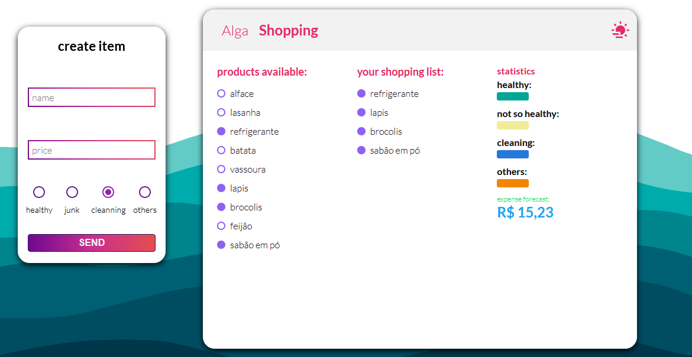
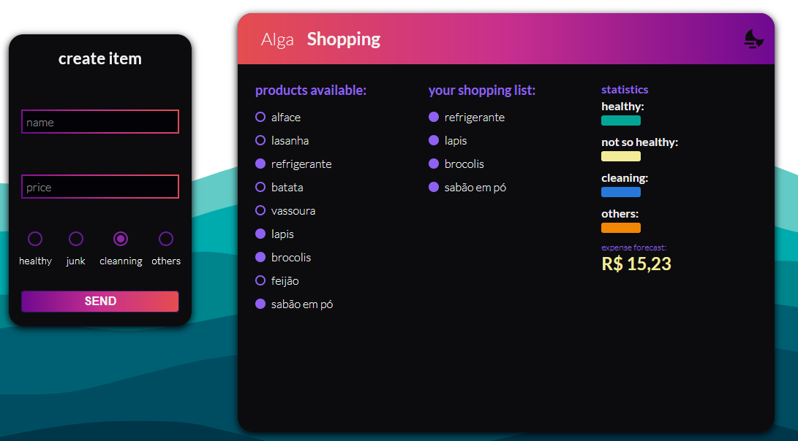

# shopping list application developed in react

- application allows the user to select the desired items while the status bar informs if the list is healthy or not, varying according to the type of item selected
* [link application](https://sea-shopping-frontend.herokuapp.com/)

> application also has dark and light theme

##
##

