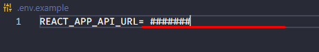

# shopping list application developed in react

- application allows the user to select the desired items while the status bar informs if the list is healthy or not, varying according to the type of item selected
* [link application](https://sea-shopping-frontend.herokuapp.com/)

> application also has dark and light theme

> desktop version
#

##

##
> mobile version
#

#

- 🚨 to use the design on your machine, follow the step by step below

> after cloning the project and downloading all dependencies using __yarn__ or __npm I__, add in the __root of the project__ a file with the __.env__ extension and insert in the environment variable the following URL
#

#
⚡⚡⚡⚡
> http://localhost:5500

⚡⚡⚡⚡

> after that, the frontend part is finished, now you will need the backend part for the project to work properly, follow the next steps in the repository below
[sea-shopping-backend](https://github.com/marcosDmc/sea-shopping-backend.git)

